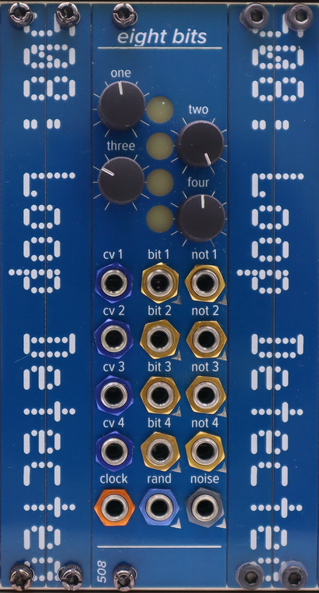

# eight bits

Four random gates and their four opposites. Input a clock. Adjust the pots to control the probability of each of the left or right random gates firing -- with every clock tick, either the left or the right will fire.

The source of randomness is analog noise. You get noise, a random stepped voltage, and four random bits which are the result of comparing the random voltages with control voltage. When CV is plugged in to any of the four CV inputs, its pot becomes an attenuator for that CV input. 

The most human-readable BOMs are the ones with `fixed` in front of the name. The other BOMs are the ones generated by the EDA software. You can use them, the gerbers, and the pick-and-place files to order boards pre-populated with [some of] the SMD parts.

There are two trimmers for calibration. 

- VR1 controls the amplitude of the noise -- watch the noise output on a scope and adjust it until it's not brickwalling against the rails, and is around +/- 6V (12Vpp). 
- VR2 controls the offset -- watch the random bits output on a scope and adjust it until you're never dropping below zero, and are getting about as many bits close to 0V as you are close to 5V. All the steps should be between 0V and 5V, so if you're going over/under, adjust VR1 until you aren't, and then re-tweak VR2 until you're more or less centered around 2.5V.

This module, like many of my modules, uses 2mm-pitch male/female headers. Be sure you order/use the right thing!

Generally speaking, most ICs are SOIC 8/14/16, and all passives are 0805.
